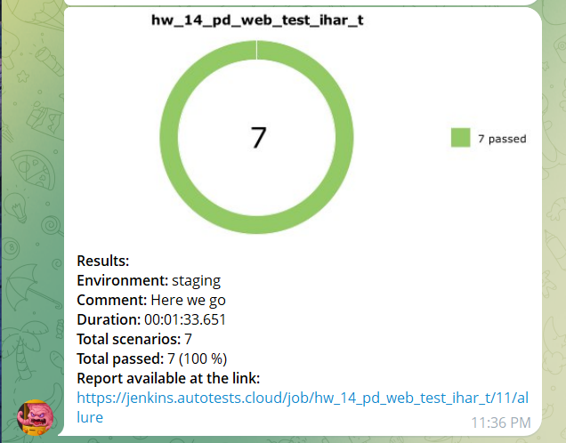

# 🐼 PandaDoc Web Autotests

Automation testing for **PandaDoc website** using Python, Pytest, Selene, Allure, Jenkins 

---

## 📖 About the project

UI test framework for PandaDoc.  
Covers **smoke** and **regression** scenarios for:

- **Homepage** — header & footer checks  
- **Pricing** — plans presence, CTA buttons, price toggle  
- **Templates** — template search and filtering  
- **Forms** — validation of *Request a Demo* and *Contact Sales* forms  
- **Navigation** — correctness of main menu links  

Page Object Model (POM) is implemented for structured page logic.

---

## 🛠️ Technologies & Tools

<p align="center">
  
  
  
  
  
  
  
  
  
</p>

---

## ▶️ Run tests locally

Clone the repository:

```bash
git clone https://github.com/username/pd_web_tests_selene.git
```
Install dependencies:
```bash
pip install -r requirements.txt
```
Run tests with Allure report generation:
```bash
pytest --alluredir=allure-results
```
View Allure report:
```bash
allure serve allure-results
```

---

## ⚙️ Run tests in Jenkins

1. Log in to **Jenkins**  
2. Select the job **`hw_14_pd_web_test_ihar_t`**  
3. Click **Build Now**  
4. After the run finishes, open the **Allure Report** or **Allure TestOps**  icon on the build page


---

## 📊 Reports

### Allure Report


### Allure TestOps


### Telegram Notifications


---

